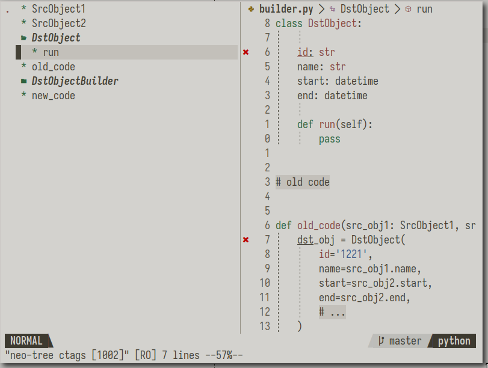

# neo-tree-ctags

An extension for [neo-tree.nvim](https://github.com/nvim-neo-tree/neo-tree.nvim)
implementing a source for viewing buffer ctags.



## Installation

Installing this plugin should be possible using your package manager of choice,
assuming neo-tree.nvim has been installed.

The following uses [paq](https://github.com/wbthomason/packer.nvim):

```lua

require "paq" {
    "savq/paq-nvim",
    "nvim-neo-tree/neo-tree.nvim",
    "d00h/neo-tree-ctags.nvim",
}
```

## Configuration

Configuration is done within the neo-tree config:

```lua
require("neo-tree").setup({
  sources = {
    "filesystem",
    "buffers",
    "git_status",
    "ctags",
    -- ...and any additional source
  },
...
})
 ```
## Usage 

 ```
Neotree current ctags reveal
 ```

## Respects

* [An extension for neo-tree.nvim implementing a source for viewing workspace diagnostics](https://github.com/mrbjarksen/neo-tree-diagnostics.nvim)
